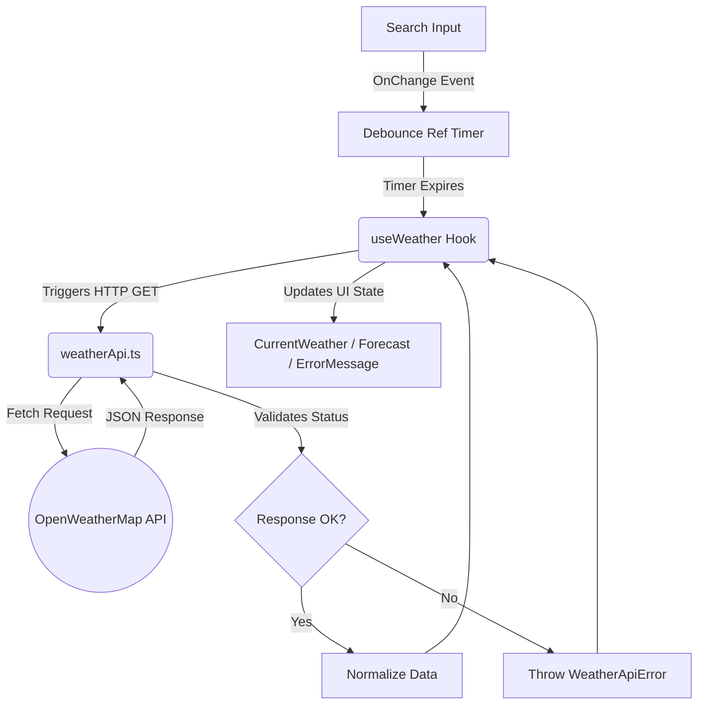
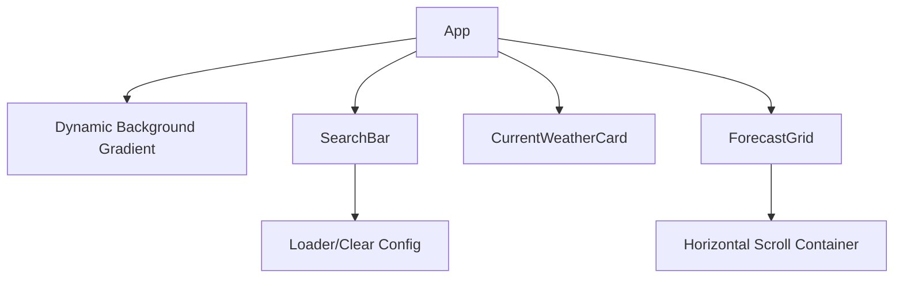

# System Architecture: Weather App

## 1. High-Level Overview
The SyntecXhub Weather App is a dynamic, data-driven application connecting to the OpenWeatherMap API. The architecture centers around an "Ambient Glass UI" concept where application state (weather conditions) directly drives the CSS environment via injected class styles.

## 2. Technology Stack
- **Core:** React 19, TypeScript 5.7
- **Bundler:** Vite 6.0
- **Styling:** Tailwind CSS v4 (Glassmorphism & Backdrops)
- **External Services:** OpenWeatherMap REST API

## 3. Data Flow & Integration



## 4. Component Hierarchy


## 5. Architectural Highlights
- **Bento Grid**: A custom CSS Grid system (`grid-template-columns: repeat(4, 1fr)`) designed for high information density and responsive fluidity.
- **Dynamic CSS Environments**: Application background and card orbs react dynamically to weather condition codes (Sunny, Cloudy, etc.).
- **Debounce Logic**: `useWeather` hook implements a 500ms debounce ref to prevent API rate-limiting during active typing.
- **Error Resiliency**: Custom `WeatherApiError` class provides granular feedback for 401 (API key), 404 (City not found), and 429 (Limits) statuses.

## 6. File Structure
```text
/src
 ├── /api
 │   └── weatherApi.ts        # Direct integrations mapped to API params
 ├── /components              # Aesthetic UI renderings
 │   ├── CurrentWeatherCard.tsx    
 │   ├── ErrorMessage.tsx
 │   ├── ForecastGrid.tsx 
 │   ├── SearchBar.tsx
 │   └── WeatherSkeleton.tsx  # Async load placeholders
 ├── /hooks
 │   └── useWeather.ts        # Handles delays, Promise.allSettled
 ├── /types
 │   └── weather.types.ts     # OpenWeatherMap strict shapes
 ├── App.tsx                  # Layout and thematic wrapper
 ├── index.css                # Base visual theme tokens
 └── main.tsx                 # Bootstrapper
```

---
**Developer:** LSR Vidanaarachchi<br>
**Portfolio:** [lakidev.me](https://lakidev.me/)<br>
**GitHub:** [lakipop](https://github.com/lakipop)<br>

*Developed for the SyntecXhub Internship Program*